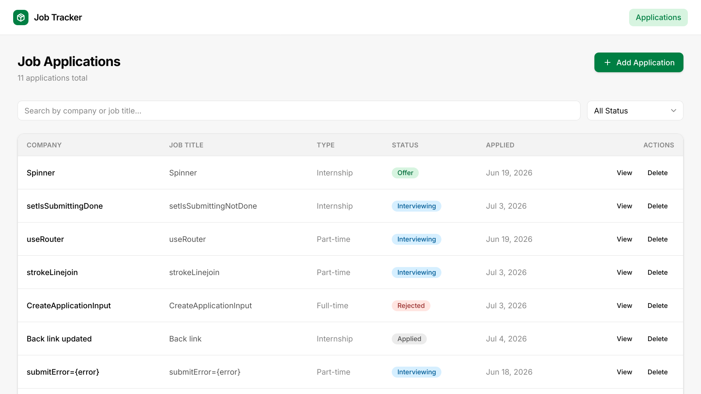
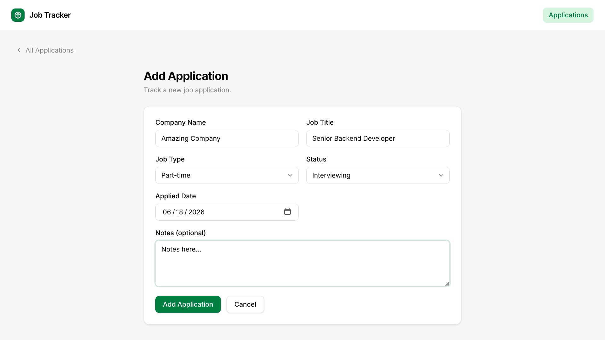
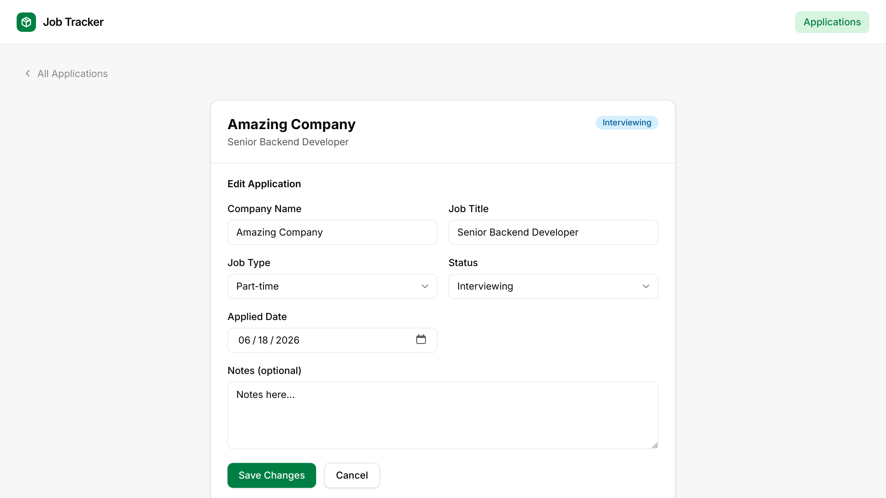
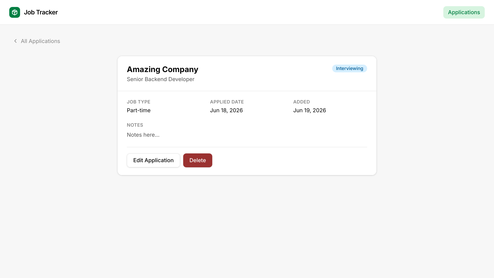

# mini-jat (Job Application Tracker)

A minimal full-stack job application tracker. Record every application you submit, track its status through the pipeline, and keep notes — all in one clean interface.

## Screenshots

### Dashboard


### Create Application


### Edit Application


### View Application


## Tech Stack

| Layer | Technology |
|---|---|
| **Client** | Next.js 16 (App Router), Tailwind CSS v4, TypeScript |
| **Server** | Express 5, Drizzle ORM, node-postgres, TypeScript |
| **Database** | PostgreSQL 16 |
| **Testing** | Vitest (server unit tests) |
| **Infra** | Docker, docker-compose |

## Project Layout

```
mini-jat/
├── client/               # Next.js 16 app
│   └── src/
│       ├── app/          # App Router pages
│       ├── components/   # UI + feature components
│       ├── hooks/        # Data-fetching hooks
│       ├── lib/          # API client, schemas, utils
│       └── types/        # Shared TypeScript types
├── server/               # Express API
│   └── src/
│       ├── db/           # Drizzle schema + migrations
│       ├── middleware/   # errorHandler, validate
│       ├── modules/
│       │   └── applications/   # routes, controller, service, validator
│       └── types/        # API response types
└── docker-compose.yml
```

## Quick Start (Docker)
Prerequisites: Docker and docker-compose installed.
```bash
# Clone and enter
git clone https://github.com/xpsaroj/mini-jat.git
cd mini-jat

# Start all services (Postgres + server + client)
docker compose up --build
```

Open **http://localhost:3000**.

To stop and remove all containers + volumes:
```bash
docker compose down -v
```

## Local Development (without Docker)

**Prerequisites:** Node 20+, PostgreSQL 15+ running locally.

### Clone the repo
```bash
# Clone and enter
git clone https://github.com/xpsaroj/mini-jat.git
cd mini-jat
```

### Server
```bash
cd server
cp .env.example .env
# Edit .env: set DATABASE_URL to your local postgres connection string

npm install
npm run db:push          # push schema directly (skips migration files)
npm run dev              # starts on http://localhost:4000
```

### Client  (new terminal)
```bash
cd client
cp .env.example .env.local

npm install
npm run dev              # starts on http://localhost:3000
```

## Environment Variables

### `server/.env`

| Variable | Default | Description |
|---|---|---|
| `DATABASE_URL` | — | PostgreSQL connection string (required) |
| `PORT` | `4000` | HTTP port |
| `NODE_ENV` | `development` | `development` or `production` |
| `CLIENT_URL` | `http://localhost:3000` | CORS allowed origin |

### `client/.env.local`

| Variable | Default | Description |
|---|---|---|
| `NEXT_PUBLIC_API_URL` | `http://localhost:4000/api` | Base URL of the Express API |

## Tests (Server only)

```bash
cd server
npm run test
```

## API Reference

Base path: `/api`

| Method | Path | Description |
|---|---|---|
| `GET` | `/health` | Health check |
| `GET` | `/api/applications` | List applications (filterable, paginated) |
| `POST` | `/api/applications` | Create an application |
| `GET` | `/api/applications/:id` | Get a single application |
| `PATCH` | `/api/applications/:id` | Partial update |
| `DELETE` | `/api/applications/:id` | Delete |

### Query Parameters — `GET /api/applications`

| Param | Type | Default | Description |
|---|---|---|---|
| `status` | `Applied \| Interviewing \| Offer \| Rejected` | — | Filter by status |
| `search` | `string` | — | Case-insensitive search on company name or job title |
| `page` | `number` | `1` | Page number |
| `limit` | `number` | `10` | Results per page (max 100) |

### Application fields

| Field | Type | Notes |
|---|---|---|
| `company_name` | `string` | Required |
| `job_title` | `string` | Required |
| `job_type` | `"Internship" \| "Full-time" \| "Part-time"` | Required |
| `status` | `"Applied" \| "Interviewing" \| "Offer" \| "Rejected"` | Required |
| `applied_date` | `string` (YYYY-MM-DD) | Required |
| `notes` | `string` | Optional |

### Response Structure
- health check
```json
{
    "status": "ok",
    "timestamp": "2024-06-01T12:00:00Z"
}
```

- list applications
```json
{
    "data": [
        {
            "id": 1,
            "company_name": "Acme Corp",
            "job_title": "Software Engineer",
            "job_type": "Internship",
            "status": "Interviewing",
            "applied_date": "2024-05-30",
            "notes": "Notes here...",
            "created_at": "2026-06-18T20:16:02.803Z",
            "updated_at": "2026-06-18T20:16:02.803Z"
        },
        // ...
    ],
    "total": 11,
    "page": 1,
    "limit": 10,
    "totalPages": 2
}
```

- single application
```json
{
    "data": {
        "id": 12,
        "company_name": "Spinner",
        "job_title": "Spinner",
        "job_type": "Internship",
        "status": "Offer",
        "applied_date": "2026-06-19",
        "notes": "Notes here...",
        "created_at": "2026-06-18T20:16:02.803Z",
        "updated_at": "2026-06-18T20:16:02.803Z"
    }
}
```

## Development Commands

### Server (`cd server`)

```bash
npm run dev          # ts-node-dev with watch
npm run build        # compile TypeScript → dist/
npm run typecheck    # tsc --noEmit
npm run lint         # Run ESLint
npm test             # Vitest unit tests

npm run db:generate  # generate a new Drizzle migration
npm run db:migrate   # apply pending migrations
npm run db:push      # push schema directly (dev shortcut)
npm run db:studio    # open Drizzle Studio in browser
```

### Client (`cd client`)

```bash
npm run dev          # Next.js dev server (Turbopack)
npm run build        # production bundle
npm run lint         # Run ESLint
```